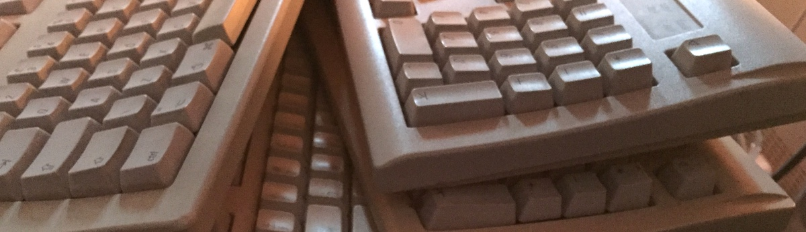

# Vintage Apple Mac stuff

Apple Mac items for sale or donation from the 80s onwards, mostly 90s. I’m not a collector or hoarder, just can’t face throwing Apple stuff away. I store it carefully away from temperature extremes and sunlight, etc. I’m in the U.K. but can ship smaller items—can’t face the risk of packing desktops or monitors though.

- [Vintage Mac Hardware](vintage-mac-hardware.md)
- [Vintage Mac Software](vintage-mac-software.md)

No idea what to ask for many items, some possibly free to collect, a few scarce/unusual items for offers or to work out a value.

Some machines were used to run exhibited versions of my digital art software [cubeLife](https://cubelife.org) so I might want to keep them (PowerPC 8500/150, Power Mac G4, white iMac). Also, might or might not want to keep the Powerbook 100 (my first laptop, but needs a recap which I’d like someone more experienced to do).
