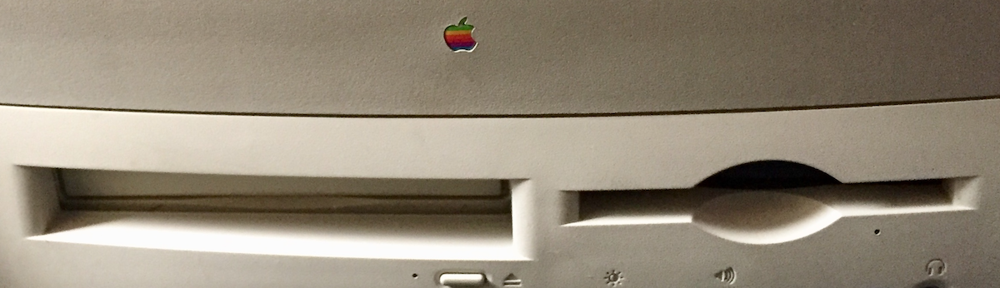

# Vintage Apple Mac hardware

Some need files on HD removing/reformatting, possibly recapping (if not started recently).

??? = Not decided to keep or sell yet.

## Laptops and desktops

All stored in my house, good condition. Were mine, my father’s or colleagues’ former work machines.

For machine-specific Apple software and manuals see below.

- **Powerbook 100**: my first laptop kept for sentimental reasons, needs recap. Almost mint condition, maxed RAM, external floppy, charger, manual and docs.
- **Powerbook 170**: (one of the original 3 powerbook line) hard drive dead replacement available, charger.
- **Macintosh LC**: 1990 Model M0350, contains various DTP software (images: [front](vintage-apple-images/vintage-apple-hardware/macintosh-lc/macintosh-lc-01.jpg), [back](vintage-apple-images/vintage-apple-hardware/macintosh-lc/macintosh-lc-02.jpg), [ID plate](vintage-apple-images/vintage-apple-hardware/macintosh-lc/macintosh-lc-03.jpg), [inside](vintage-apple-images/vintage-apple-hardware/macintosh-lc/macintosh-lc-04.jpg))
- **Performa 5200**: 8mb RAM System 7.5.3
- **Power Macintosh 7200/90** LOL—including voice control with a little figure called 'Lisa’…
- **Tangerine iMac**: matching puck mouse, keyboard (mouse/keyboard need finding by me) and tangerine earbuds. Tangerine iPod mini and speaker, available on request. Nice little “full tangerine” set (it was my late father’s)
- **MacBook** (white, 13-inch, Mid 2010): 2.4 GHz Intel Core 2 Duo, 8 GB 1067 MHz DDR3, Graphics NVIDIA GeForce 320M 256 MB, Serial 451121C8F5X, OS X Sierra 10.12.6

### Details TBC:

- ??? **PowerPC 8500/150** (extra RAM available)
- ??? **white iBook** (the little one)
- ??? **white iBook** (the unibody one)
- ??? **white all-in one iMac** (two, one futzed)
- **silver all-in one iMac**
- ??? **Power Mac G4 "Sawtooth"** (grey,silver) boxed, matching screen, manual, docs. PowerPC 7400 (G4) CPU (reserved) 
- **Apple wireless keyboard** (IIRC one key is intermittently faulty)
- **Apple compact external keyboard** (USB)
- **Apple bluetooth trackpad**

Various vintage Apple keyboards to match.

## iPads and iPhones (Specs TBC)

- **iPod Classic 120GB**, boxed, mint
- **iPod mini** (tangerine, matches iMac above)
- **iPhone 6**, boxed, VGC

## Apple printers

- **Apple Personal LaserWriter NT**: Postscript Level 1 300DPI (reserved)
- **Apple Laserwriter 4/600**: Postscript Level2 600DPI
- **Apple portable colour Stylewriter 2200** (two) one boxed, worked when last used, other needs attention

## Apple Keyboards/cables

- many, to match Macs listed above
- two boxes of ADB cables, SCSI connectors/terminators etc.

## Vintage peripherals

- **Quantum 1.2GB** SCSI external hard drive
- **Syquest 44MB** SCSI storage drive: with cartridges
- ??? **Zip drive**: two(?) one boxed
- **Ortek MacPad**: ADB number pad, in original PowerBook dark grey
- **Poweruser 44MB SCSI storage drive**: cover slightly worn
- **Umax Vista S8** scanner (SCSI/serial connections)
- **Linotype-Hell Jade 1**: scanner boxed, SCSI/serial, high-quality scanner with LinoScan software
- **Kensington TurboMouse trackball**: pale “Apple” beige/grey, ADB with cable
- **Kensington Orbit trackball**: ADB/USB, boxed
- **Quantum Maverick ProDrive**: internal HD

## Modems etc.

- **Apple Geoport** internal modem card
- **Swann MacSurfer** 56k USB modem
- **BT Speedway ISDN** PCI card, boxed
- **Motorola 3400** Pro Online modem v.34 28.8: manuals, cable missing

## Third-party printers/misc. (some junk)

- **ALPS MD2010** Dry Process colour Printer
- **Epson Stylus Color 500** - SCSI/serial (feed tray extension missing)
- **HP A3** printer
- **other inkjet printers** TBC
- Miscellaneous **RAM** for older Macs

