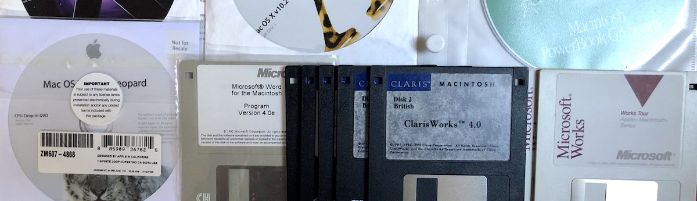

# Vintage Apple Mac software etc.

Most software boxed, some with licences, some unregistered or unused. Boxes in variable condition, some excellent, some creased but intact.

Machine-specific Apple software and manuals should stay with the machines listed in “Apple Mac hardware”

## System software

- **BeOS** Preview Release CD
- **Powerbook G3 software** install/restore CD
- 7, **Apple Multiscan screen software**, disk
- **Apple Studio Display software**, CD
- **Power Mac G4 System** Software:
  - 7.0
  - 7.6
  - 8.5 +8.6
  - OS X Tiger
  - OS X Leopard CD only
  - OS X Snow Leopard CD only

## Apple II application software

- **Ormbeta Compact Accounting System**: rare obscure demo version, disks in vinyl folder, written in Pascal, have some extra info, but brief mentions can only be found on the WayBackMachine

### System 6 Application software

- **Microsoft Works 2.0**: disk x, unused manuals (Lessons, Quick Reference Guide with fold-out ‘Roadmap’)
- **Microsoft Word 4.0e**: disk only
- **Claris Works 4.0**: System 6.05 or 7 (1991), office suite software, with Central Point Antivirus, boxed, full manuals/leaflets, unregistered licence (disk x2 only??)
- **Hypercard**: system 6 and 7+ full boxed version, manuals
- **Sam AntiVirus 4.0**: for Mac 6.05+ (collectable), sealed box, manuals and discs, unused with unregistered licence

### System 7 Application software

- 7.0+, **Supercard 3.0**, (media TBC)
- 7.1+, **Filemaker Pro 3.0**
- 7+ **Claris HomePage 3.0** (upgrade, 1994): Mac OS or Windows 95/NT 4.0 web building software. Made my first website with this.
- **Claris Organiser 1.0v2**: (1994) 'bundled, not for resale' boxed with manual and unregistered licence
- **Microsoft FoxPro 2.5**: for Mac System 7+, a rarity, Microsoft's vintage relational database management system software for Mac Classic. Unused, boxed with full manuals/leaflets and unregistered licence
- 7+, **Quark XPress** (all full versions from 2.0, details TBC)
- 7.51 and 8+, **Code Warrior Pro 5.0**, (vTBC)
- 7+, **KTP Bryce** 1.0 (boxed contents sealed), disk +CD
- 7+, **KTP Vector Effects**
- 7+, **Macromedia Freehand Graphics Studio 7**: boxed, whole graphics suite including Extreme 3D 1.0, CDs
- 6,7?, **Microsoft Office** trade-in pack, disk

### OS X Application software

- **Microsoft Office** various versions, incl. 10.8+, Office 2004 Student and Teacher (3 installs, at least 1 used)
- FileMaker Pro

## Other utility software (prefixed by Mac System, some educated guesses)

- 6/7, **Adobe Type Manager**, disk
- 6?/7, **Code Warrior 4**
- 6/7, **MacPeak Spot On** disk utilities, disk
- 6/7+, **Designer Font Pack**
- 6/7?, **Honeywell Mouse Driver** Software v8.06 1992, disc
- 6/7?, **Ambrosia Utilities**, 1994, disc, original packaging
- 7+, **Key Fonts**, disk x6
- 7?, **Ram Doubler**, **Speed Doubler**
- 7.1, **Suitcase**, v?, disk
- 7+, **Macromedia Freehand Graphics Studio**, various patches, disks
- 7.6, **DataViz MacLink Plus**: Mac/PC file **converter**
- 7+, **StyleScript** 3.0, CD
- 7+, OS X, **Supercard**: software-buidling, Hypercard-style
- 7+, X, **Norton Utilities** versions 2.0/3.5 (System 7), 5.0 (System 8-9), 7 (OS X v?), boxed, manuals
- 7+, **Norton Essentials** for Powerbook 1.1: boxed, sealed manuals and discs, unused with unregistered licence
- 8,9, **Norton Antivirus** v5, CD

### Manuals and books, misc.

- Macintosh Plus, A Guided Tour: sealed audio cassette
- KPT Vector Effects
- Kai's Power Tools
- handbooks for various Apple software etc.
- Macromedia Fireworks 2 (unused)
- SAMS Teach Yourself Mac OS 8.5 in 24 hours book
- The Official Quark XPress Handbook (version 3.1)

Many others.

## MacUser UK magazines

Mostly complete, very few issues missing or already sold:

- One copy of pilot issue 1
- apr1995-july1996
- apr1995-june2006
- aug1996-jan1998
- jan1998-nov1999
- jan2001-jan2004
- mar1999-nov2000
- CDs from many issues (photo available)

Postage UK: 2nd class: £3.20; USA: £20.85

## SOLD

- CuBase
- Photoshop v1